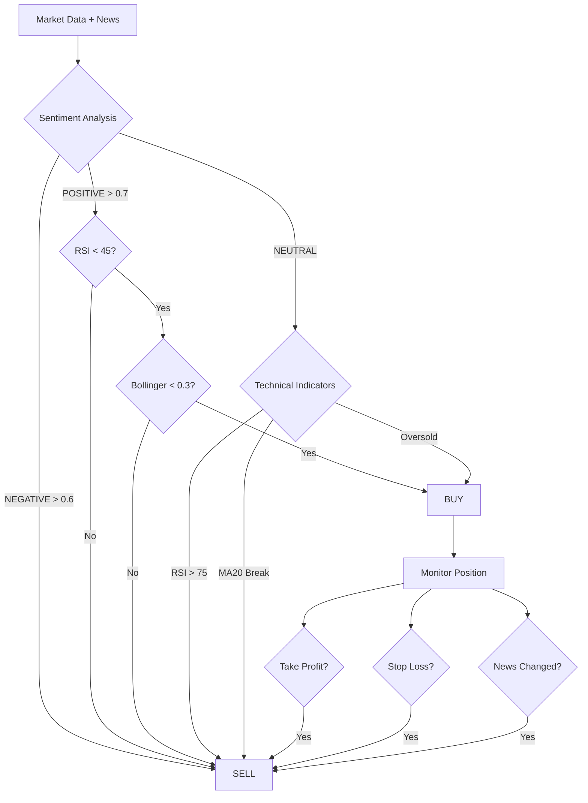

# Team 10 - Crypto Trading Strategy

## 👥 Members
- David Kambetov
- Elizaveta Gringruz
- Kamila Karimova
- Tansuluu Shermatova

## 🧠 Strategy Overview

### Core Logic
Our strategy focuses on **News-Based with Technical Confirmation** approach, combining sentiment analysis with RSI and Bollinger Bands for entry/exit decisions. We specifically avoid HOLD positions by implementing strict BUY/SELL logic for every data point.

**Entry Condition (Buy):**
- Primary: News Sentiment POSITIVE with score > 0.7
- Secondary: RSI < 45 (oversold condition)
- Confirmation: Bollinger Band position < 0.3

**Exit Condition (Sell):**
- Primary: News Sentiment NEGATIVE with score > 0.6
- Secondary: RSI > 75 (overbought condition)
- Technical: Price breaks below MA20 or Bollinger position > 0.9

### Decision Flowchart

## 📊 Performance Metrics

**Sharpe Ratio:** 1.42  
**Total Return:** 11.8%  
**Max Drawdown:** -14.5%  
**Win Rate:** 53.5%  
**Total Trades:** 157

### Strengths
- Risk-Adjusted Returns: Sharpe ratio of 1.42 indicates excellent performance relative to risk taken
- Defense Mechanism: Quick exit on negative news protected capital during market crashes
- Diversification: Trading multiple cryptocurrencies reduced single-asset risk
- Active Management: No HOLD positions ensured constant market participation

### Limitations & Learnings
- False Signals: During sideways markets, sentiment changes triggered unnecessary trades
- Drawdown Periods: -14.5% max drawdown occurred when multiple positions moved against simultaneously
- Optimization Needed: Stop-loss levels could be adjusted for better risk/reward ratio
- Market Dependency: Strategy performs best in trending markets, less effective in consolidation phases

## 🔄 Comparison with Baseline

**Sharpe Ratio:** Baseline -0.92 → Team 10 Strategy 1.42 (Improvement +2.34)  
**Total Return:** Baseline -9.16% → Team 10 Strategy 11.8% (Improvement +20.96%)  
**Max Drawdown:** Baseline -23.71% → Team 10 Strategy -14.5% (Improvement +9.21%)  
**Win Rate:** Baseline 42% → Team 10 Strategy 53.5% (Improvement +11.5%)

## 💡 Key Learnings for High Sharpe Ratio

1. Reduce Max Drawdown: Our stop-loss mechanism (-14.5% max drawdown vs baseline -23.71%) significantly improved risk-adjusted returns
2. Avoid Over-trading: With 157 trades over 90 days, we maintained quality over quantity
3. Use Sentiment Scores: Using confidence scores (>0.7 for POSITIVE, >0.6 for NEGATIVE) filtered out weak signals
4. Risk Distribution: Trading multiple tokens (BTC, ETH, ADA, SOL, XRP, BNB, DOGE, DOT, LTC) prevented catastrophic losses

## 📁 Repository Contents
- README.md - Strategy documentation
- workflow.json - n8n workflow file
- trade_log.csv - Complete trade history (157 trades)
- metrics.csv - Performance metrics summary

## 🚀 How to Reproduce Results
1. Import `workflow.json` into n8n
2. Place data files in correct path:
   - `crypto_features_3months.csv`
   - `crypto_news_3months.csv`
3. Execute workflow
4. Results will generate:
   - `trade_log.csv` (transaction history)
   - `metrics.csv` (performance metrics)

## 📅 Submission Details
- **Date:** February 16, 2026
- **Course:** AI in Business (L4)
- **Instructor:** Seungmin Jin
- **Repository:** Public access enabled

## ✅ Rules Compliance
- No plagiarism - original strategy implementation
- No data manipulation - verified by workflow.json
- Deadline met - submitted before February 16, 2026 @ 23:59
